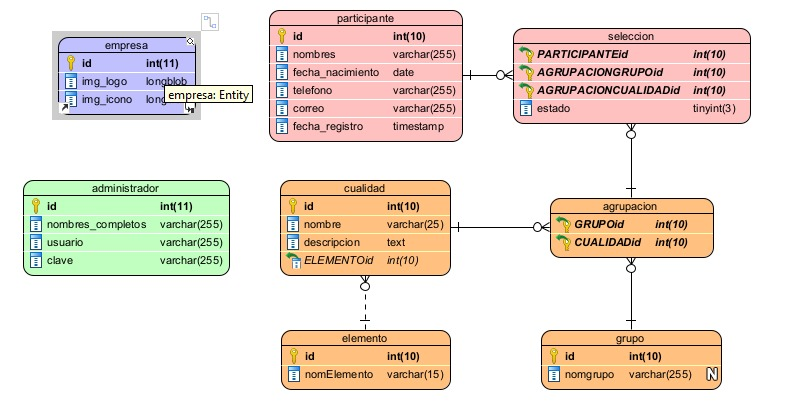
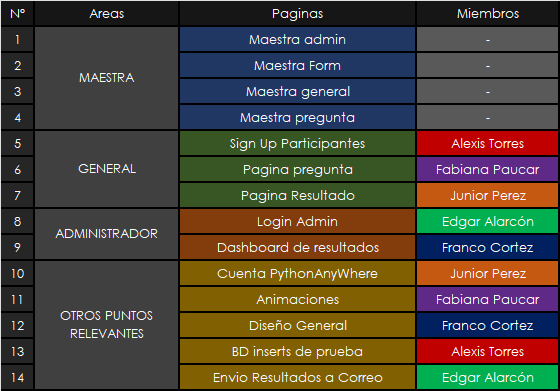

### ORGANIZACIÓN ACTUAL

-----

### BD
- Base de Datos en versiones primerizas (posibles cambios a posterior)
- FALTAN INSERTS DE:
  - administrador
  - seleccion
  

### CSS
- Mejorar diseño actual (es solo una base)

### HTML
- Mejorar estructura de las maestra de ser necesario

### JS
- Buscar libreria que se encargue de mostrar graficos de barras

### PYTHON
- Agregar controladores y modificar main

------

### pagina de activación
- **todo**
  - diseño
  - funcion python
  - pagina
  - funcionalidad basica
  - estructura
  - validaciones

### dashboard
-  diseño
-  filtro fecha
-  filtro estado
-  

### ver participante
-  diseño
   -  colores
   -  forma
   -  estructura
-  
